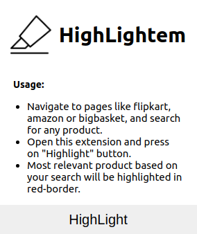

# Highlightem

Chrome extension to highlight relevant items based on your search query.

 
 
    
 

## Usage:

- Navigate to pages like flipkart, amazon or bigbasket, and search for any product.
- Open this extension and press on "Highlight" button.
- Most relevant product based on your search will be highlighted in red-border.

## Extension Installation

- Open chrome browser and enter `chrome://extensions`.
- Turn on developer-mode.
- Click on `Load Unpacked Extension`
- Select `extension` dir

You will see the extension is loaded and ready-to-use.
